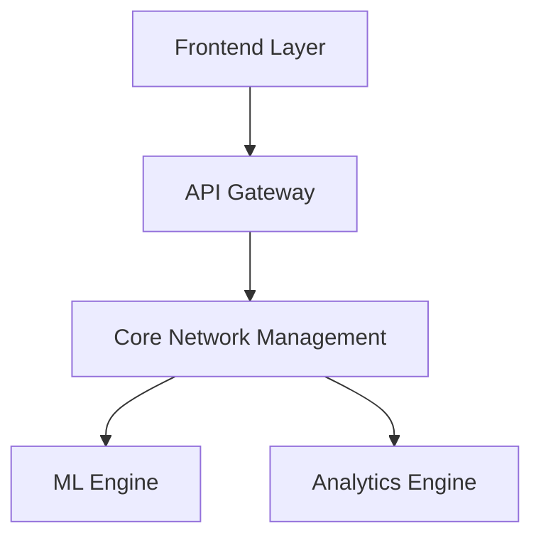

# EyeNet - Intelligent Network Management System

<div align="center">
  
  <p><em>Advanced Network Management with ML-Powered Analytics</em></p>
</div>

## 🔒 Private Repository Notice
This is a private application. Access is restricted to authorized personnel only. For access requests, please contact the repository administrators.

## 📋 Overview
EyeNet is an advanced network management system that combines traditional network monitoring with cutting-edge machine learning capabilities. It provides real-time insights, predictive analytics, and automated network optimization.

### 🌟 Key Features
- **Real-time Network Monitoring**
  - Comprehensive network status visualization
  - Performance metrics tracking
  - Resource utilization monitoring
  
- **ML-Powered Analytics**
  - Predictive maintenance
  - Anomaly detection
  - Traffic pattern analysis
  - Resource optimization

- **Automated Management**
  - Dynamic resource allocation
  - Automated incident response
  - Policy-based management
  - Configuration automation

## 🏗 Architecture
Our system follows a modular architecture designed for scalability and maintainability:



[View detailed architecture documentation](https://github.com/TadashiJei/EyeNetwork/tree/main/docs/development/architecture.html)

## 📚 Documentation

### Development Guides
- [Setup Guide](https://github.com/TadashiJei/EyeNetwork/tree/main/docs/development#setup-guide)
- [Architecture Overview](https://github.com/TadashiJei/EyeNetwork/tree/main/docs/development/architecture.html)
- [API Documentation](https://github.com/TadashiJei/EyeNetwork/tree/main/docs/api)
- [ML Integration](https://github.com/TadashiJei/EyeNetwork/tree/main/docs/ml)
- [Analytics Engine](https://github.com/TadashiJei/EyeNetwork/tree/main/docs/predictive-analytics)

### Technical Documentation
- [Configuration Guide](https://github.com/TadashiJei/EyeNetwork/tree/main/docs/config)
- [Security Documentation](https://github.com/TadashiJei/EyeNetwork/tree/main/docs/security)
- [API Reference](https://github.com/TadashiJei/EyeNetwork/tree/main/docs/api)

## 🛠 Technology Stack
- **Frontend**: PHP, JavaScript, Bootstrap
- **Backend**: PHP, Python
- **Database**: MySQL, TimescaleDB
- **ML Framework**: TensorFlow, scikit-learn
- **Monitoring**: Custom agents, RESTful API

## 🚀 Getting Started

### Prerequisites
- PHP >= 7.4
- Python >= 3.8
- MySQL >= 8.0
- Node.js >= 14.0
- Composer
- Git

### Installation
1. Clone the repository (requires access):
   ```bash
   git clone https://github.com/TadashiJei/EyeNetwork.git
   ```

2. Install PHP dependencies:
   ```bash
   composer install
   ```

3. Set up the database:
   ```bash
   php artisan migrate
   ```

4. Install Python requirements:
   ```bash
   pip install -r requirements.txt
   ```

5. Configure environment:
   ```bash
   cp .env.example .env
   php artisan key:generate
   ```

6. Start the development server:
   ```bash
   php artisan serve
   ```

## 🔐 Security
- Built-in JWT authentication
- Role-based access control
- API rate limiting
- Data encryption at rest
- Secure communication channels

## 🤝 Contributing
This is a private repository. Contributions are managed internally. Please refer to our internal development guidelines for contribution procedures.

## 📄 License
Proprietary software. All rights reserved.

## 🔗 Internal Links
- [Development Guide](https://github.com/TadashiJei/EyeNetwork/tree/main/docs/development)
- [API Documentation](https://github.com/TadashiJei/EyeNetwork/tree/main/docs/api)
- [ML Documentation](https://github.com/TadashiJei/EyeNetwork/tree/main/docs/ml)
- [Analytics Guide](https://github.com/TadashiJei/EyeNetwork/tree/main/docs/predictive-analytics)

## 📞 Support
For internal support and bug reports, please use our issue tracking system or contact the development team directly.

---
© 2025 EyeNet. All Rights Reserved.
